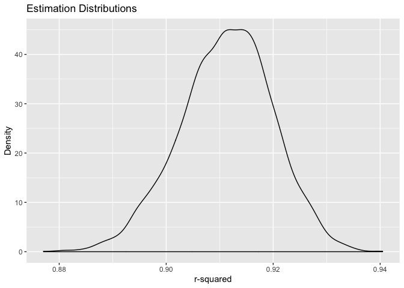
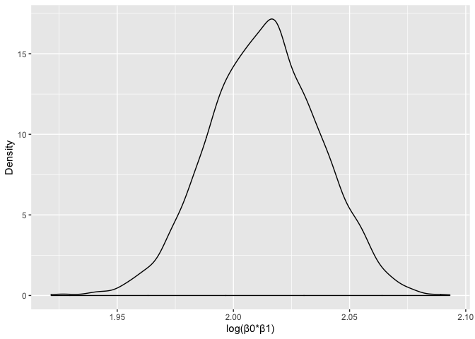

p8105\_hw6\_jc4166
================
Jerri Chen
11/21/2019

## Problem 1

Read in and clean birthweight data.

### Propose a regression model for birthweight.

The ouctome is birthweight (bwt).  
The potential predictors (i.e. all the variables collected) are:

Maternal Factors:  
\- mrace: mother’s race  
\- menarche: mother’s age at menarche  
\- mheight: mother’s height  
\- momage: mother’s age at delivery  
\- ppbmi: mother’s pre-pregnancy BMI  
\- ppwt: mother’s pre-pregnancy weight

Pregnancy Factors:  
\- gaweeks: gestational age in weeks  
\- delwt: mother’s weight at delivery (pounds)  
\- smoken: average number of cigarettes smoked per day during
pregnancy  
\- wtgain: mother’s weight gain during pregnancy

Pregnancy History Factors:  
\- parity: number of live births prior to this pregnancy  
\- pnumlbw: previous number of low birth weight babies  
\- pnumsga: number of prior small for gestational age babies

Other Family Factors:  
\- fincome: family monthly income  
\- frace: father’s race

Baby Factors:  
\- malform: presence of malformations that could affect weight

Based on my experience as a clinician, I propose a model in which low
birthweight can be predicted by gestational age in weeks, mother’s
smoking status, history of previous low birth weight babies, and family
income.

``` r
birthweight_model_1 = lm(bwt ~ gaweeks + smoken + pnumlbw + fincome, data = birthweight_data)

birthweight_model_1 %>% 
  broom::tidy() %>% 
  select(term, estimate, p.value) %>% 
  knitr::kable(digits = 3, caption = "Regression Summary (Model 1)")
```

| term        | estimate | p.value |
| :---------- | -------: | ------: |
| (Intercept) |  459.170 |       0 |
| gaweeks     |   65.438 |       0 |
| smoken      |  \-6.881 |       0 |
| fincome     |    2.353 |       0 |

Regression Summary (Model 1)

``` r
birthweight_data %>% 
  modelr::add_residuals(birthweight_model_1) %>%
  modelr::add_predictions(birthweight_model_1) %>% 
  ggplot(aes(x = pred, y = resid)) + 
    geom_point(alpha = 0.5) + 
    geom_hline(yintercept = 0, color = "blue") + 
    labs(
      title = "Model Residuals vs. Fitted Values",
      x = "Fitted Values",
      y = "Residuals"
   )
```

<!-- -->

Compare your model to two others:  
Model 2: Using length at birth and gestational age as predictors (main
effects
only)

``` r
birthweight_model_2 = lm(bwt ~ gaweeks + blength, data = birthweight_data)

birthweight_model_2 %>% 
  broom::glance()  %>%
  knitr::kable(caption = "Regression Summary (Model 2)")
```

| r.squared | adj.r.squared |    sigma | statistic | p.value | df |     logLik |      AIC |      BIC |  deviance | df.residual |
| --------: | ------------: | -------: | --------: | ------: | -: | ---------: | -------: | -------: | --------: | ----------: |
| 0.5768894 |     0.5766943 | 333.2174 |  2958.001 |       0 |  3 | \-31381.32 | 62770.64 | 62796.14 | 481775844 |        4339 |

Regression Summary (Model 2)

Model 3: Using head circumference, length, sex, and all interactions
(including the three-way interaction) between
these

``` r
birthweight_model_3 = lm(bwt ~ bhead + blength + babysex + bhead * blength + bhead * babysex + blength * babysex + bhead * blength * babysex, data = birthweight_data)

birthweight_model_3 %>% 
  broom::glance()  %>%
  knitr::kable(caption = "Regression Summary (Model 3)")
```

| r.squared | adj.r.squared |    sigma | statistic | p.value | df |    logLik |      AIC |      BIC |  deviance | df.residual |
| --------: | ------------: | -------: | --------: | ------: | -: | --------: | -------: | -------: | --------: | ----------: |
|  0.684876 |      0.684367 | 287.7344 |  1345.616 |       0 |  8 | \-30741.6 | 61501.19 | 61558.58 | 358816655 |        4334 |

Regression Summary (Model 3)

Make the comparison in terms of the cross-validated prediction error;
use crossv\_mc and functions in purrr as appropriate.

``` r
cv_birthweight_models =
  crossv_mc(birthweight_data, 100) %>%
    mutate( 
      train = map(train, as_tibble),
      test = map(test, as_tibble)
    )
```

``` r
cv_birthweight_models = cv_birthweight_models %>%
  mutate(
      birthweight_model_1  = map(train, ~lm(bwt ~ gaweeks + bhead + blength + smoken + fincome + pnumlbw, data = .x)),
      birthweight_model_2  = map(train, ~lm(bwt ~ gaweeks + blength, data = .x)),
      birthweight_model_3  = map(train, ~lm(bwt ~ bhead + blength + babysex + bhead * blength + bhead * babysex + blength * babysex + bhead * blength * babysex, data = as_tibble(.x)))
      ) %>% 
    mutate(
      rmse_birthweight_model_1 = map2_dbl(birthweight_model_1, test, ~rmse(model = .x, data = .y)),
      rmse_birthweight_model_2   = map2_dbl(birthweight_model_2, test, ~rmse(model = .x, data = .y)),
      rmse_birthweight_model_3 = map2_dbl(birthweight_model_3, test, ~rmse(model = .x, data = .y))
      )
```

``` r
cv_birthweight_models %>% 
  select(starts_with("rmse")) %>% 
  pivot_longer(
    everything(),
    names_to = "model", 
    values_to = "rmse",
    names_prefix = "rmse_") %>% 
  mutate(model = fct_inorder(model)) %>% 
  ggplot(aes(x = model, y = rmse)) + 
    geom_violin(aes(fill = model, color = model)) +
    labs(
    title = "Distribution of RMSE Values (Regression Models 1, 2, 3)",
      x = "Regression Model",
      y = "RMSE")
```

<!-- -->

Model 1 has the lowest prediction error of the three models. Model 3
appears to be a close second, though clinically I don’t think it makes
sense to have a prediction model that includes measurements that can
taken after the baby is born (i.e. baby’s length and head
circumference).

## Problem 2

Import 2017 Central Park weather data:

``` r
weather_df = 
  rnoaa::meteo_pull_monitors(
    c("USW00094728"),
    var = c("PRCP", "TMIN", "TMAX"), 
    date_min = "2017-01-01",
    date_max = "2017-12-31") %>%
  mutate(
    name = recode(id, USW00094728 = "CentralPark_NY"),
    tmin = tmin / 10,
    tmax = tmax / 10) %>%
  select(name, id, everything())
```

Simple linear regression with tmax as the response and tmin as the
predictor:

``` r
lm(tmax ~ tmin, data = weather_df) %>% 
  broom::tidy() %>% 
  knitr::kable(digits = 3)
```

| term        | estimate | std.error | statistic | p.value |
| :---------- | -------: | --------: | --------: | ------: |
| (Intercept) |    7.209 |     0.226 |    31.847 |       0 |
| tmin        |    1.039 |     0.017 |    61.161 |       0 |

Distribution of two quantities estimated from these data: r^2 and log(β̂
0∗β̂ 1). Use 5000 bootstrap samples and, for each bootstrap sample,
produce estimates of these two quantities. Plot the distribution of your
estimates, and describe these in words.

``` r
weather_estimates =
weather_df %>% 
  modelr::bootstrap(n = 5000) %>% 
  mutate(
    models = map(strap, ~lm(tmax ~ tmin, data = .x)),
    results = map(models, broom::tidy), 
    glance = map(models, broom::glance)) %>% 
  select(results, glance) %>% 
  unnest(results, glance) %>% 
  janitor::clean_names() %>% 
  select(term, estimate, r_squared) %>% 
  pivot_wider(
    names_from = term, 
    values_from = estimate)  %>% 
  janitor::clean_names() %>% 
  mutate(
    log_betas = log(intercept * tmin)
    )
```

``` r
weather_estimates %>% 
  ggplot(aes(x = r_squared)) +
  geom_density() +
  labs(
    title = "Estimation Distributions",
    x = "r-squared",
    y = "Density"
  )
```

<!-- -->

``` r
weather_estimates %>% 
  ggplot(aes(x = log_betas)) +
  geom_density() +
   labs(
    x = "log(β0*β1)",
    y = "Density"
  )
```

<!-- -->

Both plots show approximately normally distributed estimates.

Using the 5000 bootstrap estimates, identify the 2.5% and 97.5%
quantiles to provide a 95% confidence interval for r̂ 2 and log(β̂ 0∗β̂
1).

``` r
pull(weather_estimates, r_squared) %>% 
  quantile(c(0.025, 0.975))
```

    ##      2.5%     97.5% 
    ## 0.8936977 0.9274807

``` r
pull(weather_estimates, log_betas) %>%
  quantile(c(0.025, 0.975))
```

    ##     2.5%    97.5% 
    ## 1.966942 2.058528

The 95% CI for r-squared is (0.89, 0.93). The 95% CI for
log(β<sup>0∗β</sup>1) is (1.97, 2.06).
